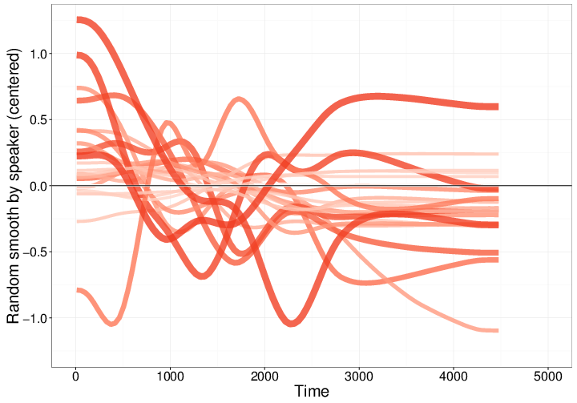

[Meredith Tamminga](http://www.meredithtamminga.com), [Aaron
Ecay](http://aaronecay.com), and I have updated
[code](https://github.com/christopherahern/GAM-DH) and renamed a paper,
*Generalized Additive Mixed Models for intraspeaker variation*, which has been
accepted for publication at [Linguistic Vanguard](http://www.degruyter.com/view/j/lingvan). We suggest GAMMs as a useful tool for separating out different sources of
repetitiveness in naturalistic speech data, taking *DH*-stoping ('that' vs.
'dat') in the [Philadelphia Neighborhood corpus](http://fave.ling.upenn.edu/pnc.html) as an example.

For each interview we want to distinguish two potential sources of
repetitiveness in the use of the different *DH* variants like 'that' and 'dat'.

* The tendency of speakers to repeat themselves. Using 'that' *primes* subsequent use of 'that'.
* The tendency of speakers to use 'that' in more formal *styles*, and 'dat' in less formal *styles*

We expect priming to be a fact about how brains and cognition work, but we don't have any expectations about how styles change over a given interview. GAMMs allows us to model priming as the effect of the previous token on the current token and model style as a smooth function of elapsed time.

Below is a plot of the random smooths by speaker. Each curve, roughly speaking, represents an estimate of the style for a given speaker in an interview. See the [data, code, and paper](https://github.com/christopherahern/GAM-DH) for more details, but intuitively, the wigglier or more non-linear the smooth, the more varied the style over the course of the interview.

